# Modelo Entidad-Relacion - Sistema de Gestion de Talleres

## Diagrama ER

```mermaid
erDiagram

    %% ─── ESTRUCTURA BASE ─────────────────────────────────────

    companias {
        uuid    id          PK
        string  nombre
        string  ruc
        string  direccion
        string  telefono
        string  correo
        boolean activo
        timestamp created_at
    }

    sucursales {
        uuid    id            PK
        uuid    compania_id   FK
        string  nombre
        string  direccion
        string  ciudad
        string  telefono
        boolean activo
        timestamp created_at
    }

    islas {
        uuid    id            PK
        uuid    sucursal_id   FK
        string  nombre
        string  descripcion
        boolean activo
    }

    %% ─── USUARIOS Y CONTROL DE ACCESO ────────────────────────

    roles {
        uuid    id          PK
        string  nombre
        string  descripcion
        boolean activo
    }

    usuarios {
        uuid    id            PK
        uuid    sucursal_id   FK
        uuid    rol_id        FK
        string  nombre
        string  username
        string  password_hash
        string  email
        boolean activo
        timestamp created_at
    }

    tecnicos {
        uuid    id                  PK
        uuid    usuario_id          FK
        uuid    sucursal_id         FK
        uuid    isla_principal_id   FK
        string  especialidades
        boolean activo
    }

    %% ─── TARIFAS ─────────────────────────────────────────────

    tarifas_hora_hombre {
        uuid    id            PK
        uuid    sucursal_id   FK
        uuid    isla_id       FK  "nullable"
        uuid    tecnico_id    FK  "nullable"
        decimal valor_hora
        date    fecha_desde
        date    fecha_hasta       "nullable - null = vigente"
    }

    %% ─── CATALOGO DE OPERACIONES ─────────────────────────────

    operaciones_catalogo {
        uuid    id                      PK
        uuid    isla_id                 FK
        string  nombre
        decimal tiempo_estandar_horas
        string  codigo_audatex          "nullable"
        text    descripcion
        boolean activo
    }

    %% ─── ASEGURADORAS ────────────────────────────────────────

    aseguradoras {
        uuid    id        PK
        string  nombre
        string  ruc
        string  contacto
        string  telefono
        boolean activo
    }

    planes_aseguradora {
        uuid    id              PK
        uuid    aseguradora_id  FK
        string  nombre
        string  descripcion
        boolean activo
    }

    %% ─── CLIENTES Y VEHICULOS ────────────────────────────────

    clientes {
        uuid    id          PK
        string  cedula_ruc
        string  nombre
        string  direccion
        string  telefono
        string  correo
        string  ciudad
        timestamp created_at
    }

    vehiculos {
        uuid    id          PK
        uuid    cliente_id  FK
        string  placa
        string  marca
        string  modelo
        string  chasis
        string  motor
        int     anio
        string  color
        timestamp created_at
    }

    %% ─── ORDENES ─────────────────────────────────────────────

    ordenes {
        uuid      id                       PK
        uuid      sucursal_id              FK
        uuid      vehiculo_id              FK
        uuid      cliente_id               FK
        uuid      asesor_id                FK
        uuid      aseguradora_id           FK  "nullable"
        uuid      plan_aseguradora_id      FK  "nullable"
        string    numero_orden
        string    estado
        timestamp fecha_ingreso
        timestamp fecha_entrega_estimada   "nullable"
        timestamp fecha_entrega_real       "nullable"
        text      observaciones
        timestamp created_at
    }

    orden_estados_historial {
        uuid      id               PK
        uuid      orden_id         FK
        uuid      usuario_id       FK
        string    estado_anterior
        string    estado_nuevo
        timestamp fecha_hora
        text      observacion
    }

    orden_eventos_historial {
        uuid      id                PK
        uuid      orden_id          FK
        uuid      usuario_id        FK
        string    tipo_evento
        string    estado_actual
        string    tabla_referencia  "nullable"
        uuid      referencia_id     "nullable"
        jsonb     datos_snapshot    "nullable"
        text      titulo
        text      detalle
        timestamp fecha_hora
    }

    %% ─── PROFORMA ────────────────────────────────────────────

    orden_piezas_danos {
        uuid    id                  PK
        uuid    orden_id            FK
        string  pieza
        string  categoria_dano      "K1 a K5"
        text    observacion
        boolean requiere_reemplazo
        decimal costo_estimado      "nullable"
        timestamp created_at
    }

    %% ─── ASEGURADORA ─────────────────────────────────────────

    orden_gestion_aseguradora {
        uuid      id                    PK
        uuid      orden_id              FK
        uuid      usuario_id            FK
        boolean   aplica_aseguradora
        string    estado
        date      fecha_envio           "nullable"
        date      fecha_aprobacion      "nullable"
        text      observaciones
        timestamp created_at
        timestamp updated_at
    }

    %% ─── REPUESTOS ───────────────────────────────────────────

    repuestos {
        uuid    id          PK
        string  nombre
        string  codigo
        string  descripcion
        boolean activo
    }

    orden_repuestos {
        uuid    id                        PK
        uuid    orden_id                  FK
        uuid    repuesto_id               FK  "nullable"
        string  descripcion_libre         "nullable - si no esta en catalogo"
        decimal cantidad
        string  estado
        string  proveedor
        date    fecha_estimada_llegada    "nullable"
        date    fecha_real_llegada        "nullable"
        decimal costo                     "nullable"
        text    observaciones
        timestamp created_at
    }

    %% ─── PLANIFICACION Y TAREAS ──────────────────────────────

    orden_isla_tareas {
        uuid      id                         PK
        uuid      orden_id                   FK
        uuid      isla_id                    FK
        uuid      operacion_catalogo_id      FK
        uuid      tecnico_id                 FK
        string    estado
        decimal   tiempo_estandar_original   "snapshot del catalogo"
        decimal   tiempo_estandar_ajustado   "puede diferir si asesor modifico"
        text      motivo_ajuste              "nullable"
        decimal   tarifa_hora_aplicada       "snapshot de tarifa vigente"
        decimal   costo_estimado             "tiempo_estandar_ajustado x tarifa"
        decimal   tiempo_real_horas          "nullable - calculado al finalizar"
        decimal   costo_interno              "nullable - tiempo_real x tarifa"
        decimal   eficiencia                 "nullable - estandar/real x 100"
        timestamp fecha_inicio_planificada
        timestamp fecha_fin_planificada
        timestamp fecha_inicio_real          "nullable"
        timestamp fecha_fin_real             "nullable"
        text      observaciones
        timestamp created_at
    }

    orden_isla_tarea_pausas {
        uuid      id              PK
        uuid      tarea_id        FK
        timestamp inicio_pausa
        timestamp fin_pausa       "nullable - null = actualmente pausada"
        text      motivo
    }

    orden_isla_tarea_eventos {
        uuid      id                 PK
        uuid      tarea_id           FK
        uuid      usuario_id         FK
        string    accion             "INICIAR | PAUSAR | REANUDAR | FINALIZAR"
        string    estado_resultante
        timestamp fecha_hora
        text      observacion
    }

    orden_isla_tarea_reasignaciones {
        uuid      id                      PK
        uuid      tarea_id                FK
        uuid      tecnico_anterior_id     FK
        uuid      tecnico_nuevo_id        FK
        uuid      usuario_responsable_id  FK
        timestamp fecha_reasignacion
        text      motivo
        decimal   tarifa_anterior
        decimal   tarifa_nueva
    }

    %% ─── CALIDAD ─────────────────────────────────────────────

    checklist_calidad_puntos {
        uuid    id            PK
        uuid    sucursal_id   FK
        string  nombre
        string  descripcion
        int     orden
        boolean activo
    }

    orden_calidad_revision {
        uuid      id                        PK
        uuid      orden_id                  FK
        uuid      usuario_id                FK
        string    resultado                 "APROBADO | RECHAZADO"
        text      observaciones_generales
        timestamp fecha_revision
    }

    orden_calidad_revision_puntos {
        uuid    id            PK
        uuid    revision_id   FK
        uuid    punto_id      FK
        string  resultado     "APROBADO | OBSERVADO"
        text    observacion
    }

    %% ─── ENTREGA ─────────────────────────────────────────────

    orden_entrega {
        uuid      id                           PK
        uuid      orden_id                     FK
        uuid      usuario_id                   FK
        timestamp fecha_notificacion_cliente   "nullable"
        timestamp fecha_entrega_real           "nullable"
        text      observaciones
        timestamp created_at
    }

    %% ─── ADJUNTOS Y NOTIFICACIONES ───────────────────────────

    adjuntos {
        uuid    id                  PK
        uuid    usuario_id          FK
        string  tabla_referencia    "nombre de la tabla origen"
        uuid    referencia_id       "id del registro origen"
        string  url
        string  descripcion
        timestamp created_at
    }

    notificaciones {
        uuid      id          PK
        uuid      usuario_id  FK  "nullable - null = para todos los jefes"
        uuid      orden_id    FK  "nullable"
        string    tipo
        string    mensaje
        boolean   leida
        timestamp created_at
    }

    %% ─── RELACIONES ──────────────────────────────────────────

    companias           ||--o{ sucursales                       : "tiene"
    sucursales          ||--o{ islas                            : "tiene"
    sucursales          ||--o{ usuarios                         : "pertenece"
    sucursales          ||--o{ tecnicos                         : "pertenece"
    sucursales          ||--o{ tarifas_hora_hombre              : "define"
    sucursales          ||--o{ ordenes                          : "registra"
    sucursales          ||--o{ checklist_calidad_puntos         : "configura"

    roles               ||--o{ usuarios                         : "asignado a"
    usuarios            ||--o{ tecnicos                         : "es"
    usuarios            ||--o{ ordenes                          : "asesora"
    usuarios            ||--o{ orden_estados_historial          : "registra"
    usuarios            ||--o{ orden_gestion_aseguradora        : "gestiona"
    usuarios            ||--o{ orden_calidad_revision           : "realiza"
    usuarios            ||--o{ orden_entrega                    : "confirma"
    usuarios            ||--o{ adjuntos                         : "sube"
    usuarios            ||--o{ orden_isla_tarea_reasignaciones  : "autoriza"

    tecnicos            ||--o{ orden_isla_tareas                : "ejecuta"
    tecnicos            ||--o{ tarifas_hora_hombre              : "tiene tarifa"
    islas               ||--o{ tecnicos                         : "isla principal"
    islas               ||--o{ tarifas_hora_hombre              : "define tarifa"
    islas               ||--o{ orden_isla_tareas                : "contiene"
    islas               ||--o{ operaciones_catalogo             : "cataloga"

    operaciones_catalogo ||--o{ orden_isla_tareas               : "referencia"

    aseguradoras        ||--o{ planes_aseguradora               : "ofrece"
    aseguradoras        ||--o{ ordenes                          : "cubre"
    planes_aseguradora  ||--o{ ordenes                          : "aplica a"

    clientes            ||--o{ vehiculos                        : "posee"
    clientes            ||--o{ ordenes                          : "genera"
    vehiculos           ||--o{ ordenes                          : "ingresado en"

    ordenes             ||--o{ orden_estados_historial          : "historial"
    ordenes             ||--o{ orden_eventos_historial          : "eventos"
    ordenes             ||--o{ orden_piezas_danos               : "proforma"
    ordenes             ||--o{ orden_gestion_aseguradora        : "gestion"
    ordenes             ||--o{ orden_repuestos                  : "repuestos"
    ordenes             ||--o{ orden_isla_tareas                : "planificacion"
    ordenes             ||--o{ orden_calidad_revision           : "calidad"
    ordenes             ||--o{ orden_entrega                    : "entrega"
    ordenes             ||--o{ notificaciones                   : "genera"

    repuestos           ||--o{ orden_repuestos                  : "requerido en"

    orden_isla_tareas   ||--o{ orden_isla_tarea_pausas          : "pausas"
    orden_isla_tareas   ||--o{ orden_isla_tarea_eventos         : "eventos"
    orden_isla_tareas   ||--o{ orden_isla_tarea_reasignaciones  : "reasignaciones"

    tecnicos            ||--o{ orden_isla_tarea_reasignaciones  : "tecnico anterior"
    tecnicos            ||--o{ orden_isla_tarea_reasignaciones  : "tecnico nuevo"

    orden_calidad_revision      ||--o{ orden_calidad_revision_puntos : "puntos"
    checklist_calidad_puntos    ||--o{ orden_calidad_revision_puntos : "evaluado en"
```



---

## Descripcion de Tablas

### Estructura Base

| Tabla | Proposito |
|---|---|
| `companias` | Datos de la empresa propietaria del sistema |
| `sucursales` | Talleres fisicos de la empresa |
| `islas` | Areas de trabajo dentro de cada sucursal (Enderezada, Pintura, Mecanica, Calidad) |

### Usuarios y Control de Acceso

| Tabla | Proposito |
|---|---|
| `roles` | Roles del sistema usados para clasificar usuarios |
| `usuarios` | Usuarios del sistema con contrasena hasheada (bcrypt). Sesion manejada via localStorage + React Context |
| `tecnicos` | Extension de usuarios que trabajan en islas. Incluye isla principal y especialidades |

### Tarifas y Catalogo

| Tabla | Proposito |
|---|---|
| `tarifas_hora_hombre` | Tarifa por hora con jerarquia sucursal > isla > tecnico. Tiene historial de vigencia |
| `operaciones_catalogo` | Catalogo flat rate de operaciones con tiempo estandar por isla. Precargado con semilla Audatex |

### Clientes, Vehiculos y Ordenes

| Tabla | Proposito |
|---|---|
| `clientes` | Datos del propietario del vehiculo. Se autocompleta via API cedula |
| `vehiculos` | Datos del vehiculo. Se autocompleta via API placa |
| `ordenes` | Orden de ingreso. Nucleo del sistema. Contiene estado actual y referencias a todo el proceso |
| `orden_estados_historial` | Cada cambio de estado con usuario, fecha y observacion. Permite medir tiempos por etapa |
| `orden_eventos_historial` | Bitacora completa de guardados y eventos de la orden, con estado actual, referencia opcional al registro afectado y snapshot JSON de los datos |

### Flujo de Taller

| Tabla | Proposito |
|---|---|
| `orden_piezas_danos` | Piezas con categoria de dano K1-K5 registradas en el levantamiento de proforma |
| `orden_gestion_aseguradora` | Estado del proceso con aseguradora. Opcional por orden |
| `repuestos` | Catalogo de repuestos |
| `orden_repuestos` | Repuestos requeridos por orden con estado de compra y llegada |

### Planificacion y Operacion por Isla

| Tabla | Proposito |
|---|---|
| `orden_isla_tareas` | Tarea planificada por isla. Guarda snapshot de tiempo estandar, tarifa y calculos de costo y eficiencia |
| `orden_isla_tarea_pausas` | Registro de cada pausa y reanudacion. Se usa para calcular tiempo real descontando pausas |
| `orden_isla_tarea_eventos` | Bitacora operativa de cada tarea: inicio, pausa, reanudacion y finalizacion con usuario y fecha/hora |
| `orden_isla_tarea_reasignaciones` | Historial de cambios de tecnico en una tarea con tarifas antes y despues |

### Calidad y Entrega

| Tabla | Proposito |
|---|---|
| `checklist_calidad_puntos` | Puntos de control configurables por sucursal |
| `orden_calidad_revision` | Resultado general de la revision de calidad de una orden (APROBADO / RECHAZADO) |
| `orden_calidad_revision_puntos` | Resultado por cada punto del checklist en una revision |
| `orden_entrega` | Registro del proceso de entrega: notificacion al cliente y confirmacion de entrega |

### Transversales

| Tabla | Proposito |
|---|---|
| `adjuntos` | URLs externas de fotos o documentos. Polimorficas: apuntan a cualquier tabla via tabla_referencia + referencia_id |
| `notificaciones` | Alertas internas para JEFE_TALLER y ADMINISTRADOR sobre atrasos, rechazos y pendientes |

---

## Campos Calculados en orden_isla_tareas

Estos campos se calculan y se persisten al finalizar la tarea para evitar recalculos:

```
tiempo_real_horas  = (fecha_fin_real - fecha_inicio_real) - suma(duracion de pausas)
costo_estimado     = tiempo_estandar_ajustado × tarifa_hora_aplicada
costo_interno      = tiempo_real_horas × tarifa_hora_aplicada
eficiencia         = (tiempo_estandar_ajustado / tiempo_real_horas) × 100
```

La tarifa que se usa siempre es la del snapshot (`tarifa_hora_aplicada`), nunca la tarifa actual, para respetar el precio al momento en que se planifico la tarea.

---

## Estados del Sistema

### Estados de Orden

```
INGRESADA → LEVANTAMIENTO_PROFORMA → GESTION_ASEGURADORA(*) → COMPRA_REPUESTO
→ PLANIFICACION_REPARACION → INICIO_REPARACION
→ CONTROL_CALIDAD → LISTO_ENTREGA → ENTREGADO

(*) GESTION_ASEGURADORA es opcional. Puede saltarse al confirmar que no aplica seguro.
```

### Estados de Tarea de Isla

```
PENDIENTE → EN_PROCESO → PAUSADA → EN_PROCESO → COMPLETADA
```

### Estados de Gestion de Aseguradora

```
NO_APLICA | PENDIENTE_ENVIO | ENVIADO | EN_REVISION | APROBADO | RECHAZADO | OBSERVADO
```

### Estados de Repuesto

```
PENDIENTE | SOLICITADO | COMPRADO | EN_TRANSITO | RECIBIDO | CANCELADO
```

---

## Notas de Implementacion

- Todos los `id` son `UUID` generados por Supabase (`gen_random_uuid()`).
- Los campos `created_at` y `updated_at` se manejan con `DEFAULT now()` y triggers en Supabase.
- La tabla `adjuntos` es polimorfica: el campo `tabla_referencia` contiene el nombre de la tabla (ej: `"orden_piezas_danos"`) y `referencia_id` el UUID del registro.
- Los snapshots en `orden_isla_tareas` (`tiempo_estandar_original`, `tarifa_hora_aplicada`) son intencionales para preservar el valor historico aunque el catalogo o la tarifa cambien despues.
- El campo `tecnico_id` en `tarifas_hora_hombre` apunta a la tabla `tecnicos`, no a `usuarios`.
